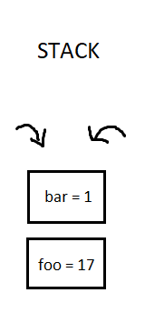
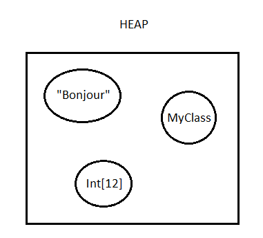

# Ce qu'il faut retenir sur les types valeur et types référence.

Lorsqu'on passe une variable en paramètre d'une fonction, on s'aperçoit qu'il y a **deux types de comportement.**

Dans un premier cas, comme avec une variable de type `int`, la valeur de la variable est copiée si bien que si elle est modifiée, **la variable d'origine** (celle utilisée au moment de l'appel de la fonction), **elle n'est pas changée.**

 

```csharp
class Program {
    static void Main(string[] args) {
        int a = 1;
        UpdateValue(a);
        Console.WriteLine(a) // 1
    }
    
    static void UpdateValue(int b){
        b = 99;
    }
}
```

Dans un deuxième cas, comme une variable de type `int[]` (un tableau de int), ce n'est pas une copie mais bien **la variable d'origine qui est modifiée**. Et cela se produit car c'est la référence de la variable d'origine qui est passée en paramètre. Grâce à cette référence (autrement dit, son emplacement ou son adresse dans la mémoire) **le programme peut la réutiliser et la modifier.**

```csharp
class Program {
    static void Main(string[] args) {
        int[] a = new int[] {1};
        UpdateValue(a);
        Console.WriteLine(a[0]); // 99
    }
    
    static void UpdateValue(int[] b){
        b[0] = 99;
    }
}
```

On peut donc regrouper les différents types de variables qu'on utilise en C# **dans deux grandes catégories.** Le premier cas est appelé "type valeur" (value type) car la variable contient une instance de type (une valeur) et c'est cette valeur qui est passée en paramètre alors que le deuxième cas est appelé "type référence" (reference type) car la variable contient une référence et c'est la référence en mémoire de la variable qui est passée en paramètre.

Dans le grand ensemble des types, nous pouvons inclure les types suivants (listes non exhaustives) :

- Types valeur ⇒ Int, bool, float, struct (que nous n'avons pas encore vu)
- Types référence ⇒ Tous les objets (donc les classes), les tableaux, les interfaces et les string (!)

# Pourquoi cette différence ?

Cela vient de la manière dont les objets sont stockés en mémoire. Chaque fois qu'on déclare une variable (par exemple `var foo = 1`) l'information est stockée dans la mémoire de l'ordinateur.

Une première mémoire s'appelle **la pile** (ou stack). A chaque déclaration de type valeur, on alloue un bloc de mémoire qu'on vient ajouter au sommet de la pile. Et quand on en a plus besoin on retire les bloc en partant du sommet en premier. Ce bloc de mémoire contient DIRECTEMENT l'information.



Une deuxième mémoire s'appelle **le tas** (ou heap). A chaque déclaration de variable de type référence, on alloue un bloc de mémoire également dans la pile que nous avons vu juste avant mais par contre ce bloc de mémoire ne contient pas une valeur mais une référence vers le tas qui lui contient l'information.



Il y a deux mémoires plutôt qu'une pour des raisons de performances. Et chaque mémoire possède ses propres caractéristiques que nous verrons plus tard.

# Les mots clefs `ref`, `out` et `in`.

**Ces trois mots clefs font essentiellement la même chose** avec quelques légères différences toutefois. Il permettent de changer le comportement des variables de types valeur en les faisant passer par référence en paramètre de fonction. Un moyen mnémotechnique pour s'en rappeler et de garder en tête le mot clef `ref` pour "référence". Encore une fois `out` et `in` font la même chose.

```csharp
static void Main(string[] args) {
        int a = 1;
        UpdateValue(ref a);
        Console.WriteLine(a); // 99
    }
    
    static void UpdateValue(ref int b){
       b = 99;
    }
```

En préfixant le paramètre attendu dans une fonction (et lors de mon appel de ma fonction) avec le mot clef ref, **j'indique que je souhaite que la référence de ma variable soit passée en paramètre.** Toutes modifications sur cette variable dans ma fonction entraineront la modification de l'originale.

Maintenant concernant les différences entre ref, out et in :

- `Ref` nécessite **obligatoirement** que la variable (a dans mon exemple) ait une valeur assignée.
- `Out` **n'a pas cette obligation**, je peux à la fois assignée une valeur ou non.
- `In`, qui n'est plus trop utilisé, est une valeur "**read-only**", c'est à dire qu'il ne sera pas possible de modifier cette variable.